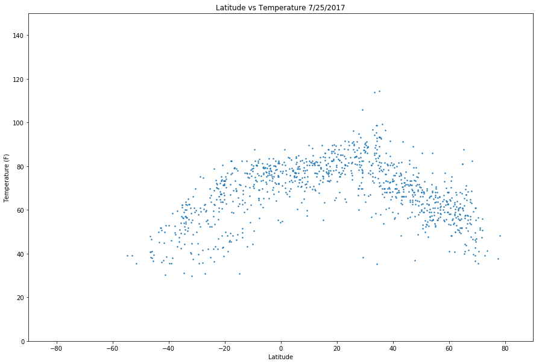
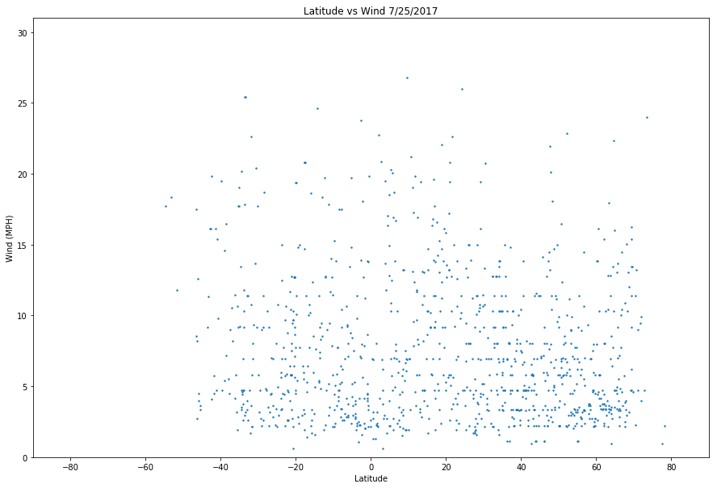

```python
%matplotlib inline
```


```python
#dependcies
from citipy import citipy
import pandas as pd
import random
import kdtree
import openweathermapy.core as owm
import requests
import seaborn as sb
import matplotlib.pyplot as plt

plt.rcParams['figure.figsize'] = [15, 10]

#config
from config import api_key
```


```python
#set empty arrays
city= []
country = []
lati = []
longi = []
#for each integer (latitude) pick 20 random integers (longitude)
#use citipy to find the nearest city to the generated lat/long
for i in range (-90, 90):
    for j in range (20):
        long = random.randint(-180, 181)
        town = citipy.nearest_city(i,long)
        city.append(town.city_name)
        country.append(town.country_code)
```


```python
#create dataframe with city and country code
df = pd.DataFrame(index=[], columns=['City','Country'])
df['City'] = city
df['Country'] = country
df.head()
```


<div>
<style scoped>
    .dataframe tbody tr th:only-of-type {
        vertical-align: middle;
    }

    .dataframe tbody tr th {
        vertical-align: top;
    }

    .dataframe thead th {
        text-align: right;
    }
</style>
<table border="1" class="dataframe">
  <thead>
    <tr style="text-align: right;">
      <th></th>
      <th>City</th>
      <th>Country</th>
    </tr>
  </thead>
  <tbody>
    <tr>
      <th>0</th>
      <td>mataura</td>
      <td>pf</td>
    </tr>
    <tr>
      <th>1</th>
      <td>bluff</td>
      <td>nz</td>
    </tr>
    <tr>
      <th>2</th>
      <td>port alfred</td>
      <td>za</td>
    </tr>
    <tr>
      <th>3</th>
      <td>mataura</td>
      <td>pf</td>
    </tr>
    <tr>
      <th>4</th>
      <td>punta arenas</td>
      <td>cl</td>
    </tr>
  </tbody>
</table>
</div>


```python
#drop any duplicate cities
df2 = df.drop_duplicates()
df2.head()
```


<div>
<style scoped>
    .dataframe tbody tr th:only-of-type {
        vertical-align: middle;
    }

    .dataframe tbody tr th {
        vertical-align: top;
    }

    .dataframe thead th {
        text-align: right;
    }
</style>
<table border="1" class="dataframe">
  <thead>
    <tr style="text-align: right;">
      <th></th>
      <th>City</th>
      <th>Country</th>
    </tr>
  </thead>
  <tbody>
    <tr>
      <th>0</th>
      <td>mataura</td>
      <td>pf</td>
    </tr>
    <tr>
      <th>1</th>
      <td>bluff</td>
      <td>nz</td>
    </tr>
    <tr>
      <th>2</th>
      <td>port alfred</td>
      <td>za</td>
    </tr>
    <tr>
      <th>4</th>
      <td>punta arenas</td>
      <td>cl</td>
    </tr>
    <tr>
      <th>5</th>
      <td>ushuaia</td>
      <td>ar</td>
    </tr>
  </tbody>
</table>
</div>


```python
#set base url and create empty arrays
url = 'http://api.openweathermap.org/data/2.5/weather?q='
Temperature = []
Humidity = []
Cloudiness = []
Wind = []
lati = []
longi = []
#for each row in dataframe grab city and country and set query url
for index, row in df2.iterrows():
    city = row['City']
    country = row['Country']
    query_url = f'{url}{city},{country}&units=imperial&appid={api_key}'
#make api request and add values to arrays   
    try:
        weather_response = requests.get(query_url)
        weather_jsons = weather_response.json()
        Temperature.append(weather_jsons['main']['temp'])
        Humidity.append(weather_jsons['main']['humidity'])
        Cloudiness.append(weather_jsons['clouds']['all'])
        Wind.append(weather_jsons['wind']['speed'])
        lati.append(weather_jsons['coord']['lat'])
        longi.append(weather_jsons['coord']['lon'])
#if an exception is thrown add NaN value to array
    except:
        Temperature.append('NaN')
        Humidity.append('NaN')
        Cloudiness.append('NaN')
        Wind.append('NaN')
        lati.append('NaN')
        longi.append('NaN')
```


```python
#add columns to dataframe
df2['Temperature'] = Temperature
df2['Humidity'] = Humidity
df2['Cloudiness'] = Cloudiness
df2['Wind'] = Wind
df2['Latitude'] = lati
df2['Longitude'] = longi
df2.head(20)
```

    C:\Users\ben16\Anaconda3\lib\site-packages\ipykernel_launcher.py:2: SettingWithCopyWarning: 
    A value is trying to be set on a copy of a slice from a DataFrame.
    Try using .loc[row_indexer,col_indexer] = value instead
    
    See the caveats in the documentation: http://pandas.pydata.org/pandas-docs/stable/indexing.html#indexing-view-versus-copy
      
    C:\Users\ben16\Anaconda3\lib\site-packages\ipykernel_launcher.py:3: SettingWithCopyWarning: 
    A value is trying to be set on a copy of a slice from a DataFrame.
    Try using .loc[row_indexer,col_indexer] = value instead
    
    See the caveats in the documentation: http://pandas.pydata.org/pandas-docs/stable/indexing.html#indexing-view-versus-copy
      This is separate from the ipykernel package so we can avoid doing imports until
    C:\Users\ben16\Anaconda3\lib\site-packages\ipykernel_launcher.py:4: SettingWithCopyWarning: 
    A value is trying to be set on a copy of a slice from a DataFrame.
    Try using .loc[row_indexer,col_indexer] = value instead
    
    See the caveats in the documentation: http://pandas.pydata.org/pandas-docs/stable/indexing.html#indexing-view-versus-copy
      after removing the cwd from sys.path.
    C:\Users\ben16\Anaconda3\lib\site-packages\ipykernel_launcher.py:5: SettingWithCopyWarning: 
    A value is trying to be set on a copy of a slice from a DataFrame.
    Try using .loc[row_indexer,col_indexer] = value instead
    
    See the caveats in the documentation: http://pandas.pydata.org/pandas-docs/stable/indexing.html#indexing-view-versus-copy
      """
    C:\Users\ben16\Anaconda3\lib\site-packages\ipykernel_launcher.py:6: SettingWithCopyWarning: 
    A value is trying to be set on a copy of a slice from a DataFrame.
    Try using .loc[row_indexer,col_indexer] = value instead
    
    See the caveats in the documentation: http://pandas.pydata.org/pandas-docs/stable/indexing.html#indexing-view-versus-copy
      
    C:\Users\ben16\Anaconda3\lib\site-packages\ipykernel_launcher.py:7: SettingWithCopyWarning: 
    A value is trying to be set on a copy of a slice from a DataFrame.
    Try using .loc[row_indexer,col_indexer] = value instead
    
    See the caveats in the documentation: http://pandas.pydata.org/pandas-docs/stable/indexing.html#indexing-view-versus-copy
      import sys
    


<div>
<style scoped>
    .dataframe tbody tr th:only-of-type {
        vertical-align: middle;
    }

    .dataframe tbody tr th {
        vertical-align: top;
    }

    .dataframe thead th {
        text-align: right;
    }
</style>
<table border="1" class="dataframe">
  <thead>
    <tr style="text-align: right;">
      <th></th>
      <th>City</th>
      <th>Country</th>
      <th>Temperature</th>
      <th>Humidity</th>
      <th>Cloudiness</th>
      <th>Wind</th>
      <th>Latitude</th>
      <th>Longitude</th>
    </tr>
  </thead>
  <tbody>
    <tr>
      <th>0</th>
      <td>mataura</td>
      <td>pf</td>
      <td>NaN</td>
      <td>NaN</td>
      <td>NaN</td>
      <td>NaN</td>
      <td>NaN</td>
      <td>NaN</td>
    </tr>
    <tr>
      <th>1</th>
      <td>bluff</td>
      <td>nz</td>
      <td>48.08</td>
      <td>100</td>
      <td>76</td>
      <td>17.49</td>
      <td>-46.6</td>
      <td>168.33</td>
    </tr>
    <tr>
      <th>2</th>
      <td>port alfred</td>
      <td>za</td>
      <td>62.3</td>
      <td>100</td>
      <td>92</td>
      <td>2.95</td>
      <td>-33.59</td>
      <td>26.89</td>
    </tr>
    <tr>
      <th>4</th>
      <td>punta arenas</td>
      <td>cl</td>
      <td>39.2</td>
      <td>91</td>
      <td>0</td>
      <td>18.34</td>
      <td>-53.16</td>
      <td>-70.91</td>
    </tr>
    <tr>
      <th>5</th>
      <td>ushuaia</td>
      <td>ar</td>
      <td>39.2</td>
      <td>64</td>
      <td>20</td>
      <td>17.72</td>
      <td>-54.81</td>
      <td>-68.31</td>
    </tr>
    <tr>
      <th>9</th>
      <td>taolanaro</td>
      <td>mg</td>
      <td>NaN</td>
      <td>NaN</td>
      <td>NaN</td>
      <td>NaN</td>
      <td>NaN</td>
      <td>NaN</td>
    </tr>
    <tr>
      <th>10</th>
      <td>hobart</td>
      <td>au</td>
      <td>51.8</td>
      <td>62</td>
      <td>20</td>
      <td>16.11</td>
      <td>-42.88</td>
      <td>147.33</td>
    </tr>
    <tr>
      <th>11</th>
      <td>hermanus</td>
      <td>za</td>
      <td>44.48</td>
      <td>95</td>
      <td>20</td>
      <td>3.51</td>
      <td>-34.42</td>
      <td>19.24</td>
    </tr>
    <tr>
      <th>14</th>
      <td>rikitea</td>
      <td>pf</td>
      <td>73.55</td>
      <td>100</td>
      <td>88</td>
      <td>4.41</td>
      <td>-23.12</td>
      <td>-134.97</td>
    </tr>
    <tr>
      <th>17</th>
      <td>bredasdorp</td>
      <td>za</td>
      <td>59</td>
      <td>82</td>
      <td>20</td>
      <td>3.36</td>
      <td>-34.53</td>
      <td>20.04</td>
    </tr>
    <tr>
      <th>18</th>
      <td>busselton</td>
      <td>au</td>
      <td>60.05</td>
      <td>100</td>
      <td>44</td>
      <td>17.83</td>
      <td>-33.64</td>
      <td>115.35</td>
    </tr>
    <tr>
      <th>19</th>
      <td>albany</td>
      <td>au</td>
      <td>56.45</td>
      <td>97</td>
      <td>92</td>
      <td>9.22</td>
      <td>-35.02</td>
      <td>117.88</td>
    </tr>
    <tr>
      <th>27</th>
      <td>vaini</td>
      <td>to</td>
      <td>75.2</td>
      <td>44</td>
      <td>20</td>
      <td>12.75</td>
      <td>-21.2</td>
      <td>-175.2</td>
    </tr>
    <tr>
      <th>28</th>
      <td>port elizabeth</td>
      <td>za</td>
      <td>62.66</td>
      <td>100</td>
      <td>76</td>
      <td>4.74</td>
      <td>-33.92</td>
      <td>25.57</td>
    </tr>
    <tr>
      <th>35</th>
      <td>new norfolk</td>
      <td>au</td>
      <td>51.8</td>
      <td>62</td>
      <td>20</td>
      <td>16.11</td>
      <td>-42.78</td>
      <td>147.06</td>
    </tr>
    <tr>
      <th>49</th>
      <td>cape town</td>
      <td>za</td>
      <td>57.2</td>
      <td>82</td>
      <td>0</td>
      <td>10.29</td>
      <td>-33.93</td>
      <td>18.42</td>
    </tr>
    <tr>
      <th>99</th>
      <td>kaitangata</td>
      <td>nz</td>
      <td>40.79</td>
      <td>99</td>
      <td>76</td>
      <td>8.21</td>
      <td>-46.28</td>
      <td>169.85</td>
    </tr>
    <tr>
      <th>122</th>
      <td>kruisfontein</td>
      <td>za</td>
      <td>54.56</td>
      <td>91</td>
      <td>8</td>
      <td>3.74</td>
      <td>-34</td>
      <td>24.73</td>
    </tr>
    <tr>
      <th>146</th>
      <td>east london</td>
      <td>za</td>
      <td>65</td>
      <td>100</td>
      <td>92</td>
      <td>3.96</td>
      <td>-33.02</td>
      <td>27.91</td>
    </tr>
    <tr>
      <th>319</th>
      <td>avarua</td>
      <td>ck</td>
      <td>73.4</td>
      <td>94</td>
      <td>75</td>
      <td>8.05</td>
      <td>-21.21</td>
      <td>-159.78</td>
    </tr>
  </tbody>
</table>
</div>


```python
#remove rows with NaN values
df3 = df2[df2.Temperature != 'NaN']
df3.head()
```


<div>
<style scoped>
    .dataframe tbody tr th:only-of-type {
        vertical-align: middle;
    }

    .dataframe tbody tr th {
        vertical-align: top;
    }

    .dataframe thead th {
        text-align: right;
    }
</style>
<table border="1" class="dataframe">
  <thead>
    <tr style="text-align: right;">
      <th></th>
      <th>City</th>
      <th>Country</th>
      <th>Temperature</th>
      <th>Humidity</th>
      <th>Cloudiness</th>
      <th>Wind</th>
      <th>Latitude</th>
      <th>Longitude</th>
    </tr>
  </thead>
  <tbody>
    <tr>
      <th>1</th>
      <td>bluff</td>
      <td>nz</td>
      <td>48.08</td>
      <td>100</td>
      <td>76</td>
      <td>17.49</td>
      <td>-46.6</td>
      <td>168.33</td>
    </tr>
    <tr>
      <th>2</th>
      <td>port alfred</td>
      <td>za</td>
      <td>62.3</td>
      <td>100</td>
      <td>92</td>
      <td>2.95</td>
      <td>-33.59</td>
      <td>26.89</td>
    </tr>
    <tr>
      <th>4</th>
      <td>punta arenas</td>
      <td>cl</td>
      <td>39.2</td>
      <td>91</td>
      <td>0</td>
      <td>18.34</td>
      <td>-53.16</td>
      <td>-70.91</td>
    </tr>
    <tr>
      <th>5</th>
      <td>ushuaia</td>
      <td>ar</td>
      <td>39.2</td>
      <td>64</td>
      <td>20</td>
      <td>17.72</td>
      <td>-54.81</td>
      <td>-68.31</td>
    </tr>
    <tr>
      <th>10</th>
      <td>hobart</td>
      <td>au</td>
      <td>51.8</td>
      <td>62</td>
      <td>20</td>
      <td>16.11</td>
      <td>-42.88</td>
      <td>147.33</td>
    </tr>
  </tbody>
</table>
</div>


```python
#create plot for latitude vs temperature
x = df3['Latitude']
y = df3['Temperature']
plt.scatter(x,y,s = 2)
plt.ylim(0, 150)
plt.xlim(-90, 90)
plt.title('Latitude vs Temperature 7/25/2017')
plt.ylabel('Temperature (F)')
plt.xlabel('Latitude')
```


    Text(0.5,0,'Latitude')





```python
#create plot for latitude vs humidity
x = df3['Latitude']
y = df3['Humidity']
plt.scatter(x,y,s = 2)
plt.ylim(0, 101)
plt.xlim(-90, 90)
plt.title('Latitude vs Humidity 7/25/2017')
plt.ylabel('Relative Humidity (%)')
plt.xlabel('Latitude')
```


    Text(0.5,0,'Latitude')


```python
#create plot for latitude vs cloudiness
x = df3['Latitude']
y = df3['Cloudiness']
plt.scatter(x,y,s = 2)
plt.ylim(0, 101)
plt.xlim(-90, 90)
plt.title('Latitude vs Cloudiness 7/25/2017')
plt.ylabel('Cloudiness (%)')
plt.xlabel('Latitude')
```


    Text(0.5,0,'Latitude')


```python
#create plot for latitude vs wind
x = df3['Latitude']
y = df3['Wind']
plt.scatter(x,y,s = 2)
plt.ylim(0, 31)
plt.xlim(-90, 90)
plt.title('Latitude vs Wind 7/25/2017')
plt.ylabel('Wind (MPH)')
plt.xlabel('Latitude')
```


    Text(0.5,0,'Latitude')




